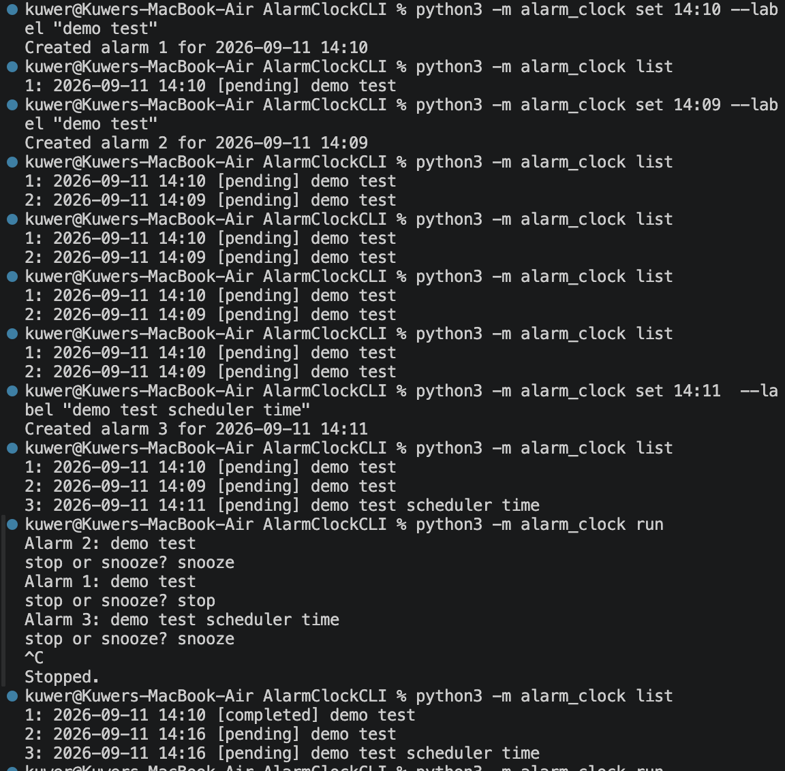

# Alarm Clock CLI

A small Python command-line alarm clock with JSON persistence. The MVP supports one-time local alarms, listing, deletion, terminal notifications, stopping, snoozing, and recovery after restarting the scheduler.

## Requirements

- Python 3.10 or newer
- No external runtime dependencies

## Setup

Clone the repository and run it from the project directory:

```bash
python3 -m alarm_clock --help
```

To install the `alarm` command locally in editable mode:

```bash
python3 -m pip install -e .
```

The project stores alarms in `data/alarms.json`. The file and its directory are created automatically when an alarm is saved. Local alarm data is ignored by Git.

## Usage

Set an alarm using 24-hour `HH:MM` format:

```bash
python3 -m alarm_clock set 14:10 --label "Demo test"
```

If the requested time has already passed today, the alarm is scheduled for the next day.

List all alarms, including completed alarms:

```bash
python3 -m alarm_clock list
```

Delete an alarm by its persistent numeric ID:

```bash
python3 -m alarm_clock delete 1
```

Start the long-running scheduler:

```bash
python3 -m alarm_clock run
```

When an alarm rings, enter `stop` to complete it or `snooze` to schedule it five minutes later. Press `Ctrl+C` to stop the scheduler.

## Working Example

```text
$ python3 -m alarm_clock set 14:11 --label "Demo test scheduler time"
Created alarm 3 for 2026-09-11 14:11

$ python3 -m alarm_clock list
1: 2026-09-11 14:10 [pending] Demo test
2: 2026-09-11 14:09 [pending] Demo test
3: 2026-09-11 14:11 [pending] Demo test scheduler time

$ python3 -m alarm_clock run
Alarm 2: Demo test
stop or snooze? snooze
Alarm 1: Demo test
stop or snooze? stop
Alarm 3: Demo test scheduler time
stop or snooze? snooze
^C
Stopped.

$ python3 -m alarm_clock list
1: 2026-09-11 14:10 [completed] Demo test
2: 2026-09-11 14:16 [pending] Demo test
3: 2026-09-11 14:16 [pending] Demo test scheduler time
```

## Screenshot

The working terminal screenshot can be added at `docs/demo.png` and referenced here:

```markdown

```

The screenshot file was not available as a workspace asset during README creation, so it is not linked yet.

## Tests

Run the test suite with:

```bash
python3 -m pytest
```

## Project Structure

- `alarm_clock/cli.py` - command parsing and terminal interaction
- `alarm_clock/models.py` - alarm data and lifecycle statuses
- `alarm_clock/service.py` - alarm creation and lifecycle operations
- `alarm_clock/repository.py` - JSON persistence
- `alarm_clock/clock.py` - local current-time provider
- `alarm_clock/scheduler.py` - polling, recovery, and sequential alarm handling
- `tests/` - automated checks